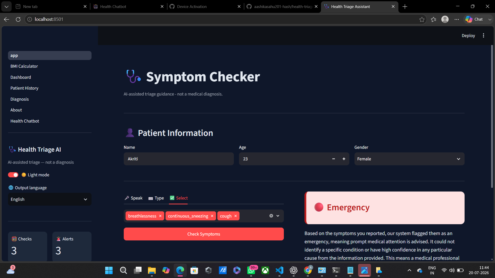
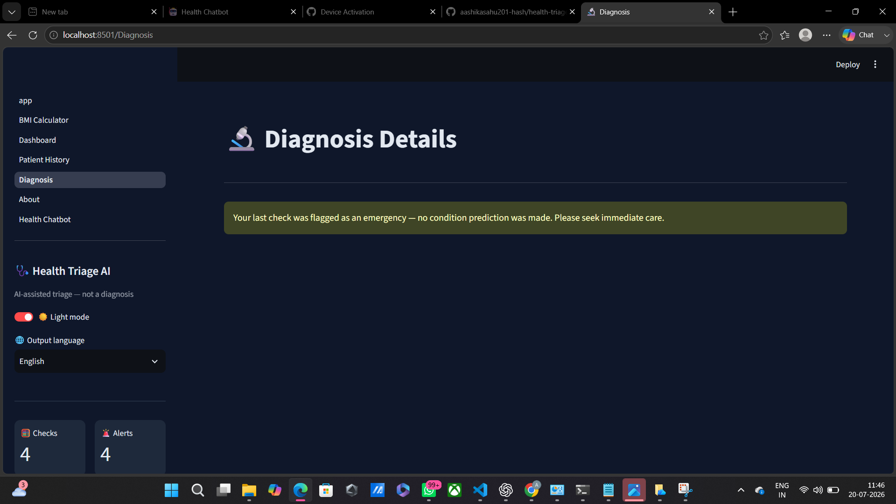

# 🩺 Health Triage Assistant

An AI-assisted symptom triage web app built as a first end-to-end machine learning project. Users describe symptoms by voice, text, or manual selection, and the app returns an urgency level, a likely condition, and general guidance - clearly framed as triage assistance, not a medical diagnosis.

## 📸 Screenshots

| Symptom Checker | Diagnosis Details |
|---|---|
|  |  |

## ✨ Features

- 🎤 Multi-modal symptom input - speak (Whisper, auto-translated), type (any language), or manually select from 131 symptoms
- 🚨 Safety-first triage - a deterministic rules layer catches red-flag symptoms and immediately recommends emergency care, bypassing the ML model entirely
- 🔬 ML-based prediction - XGBoost classifier returning the top 3 most likely conditions with confidence scores
- 🤖 AI explanations - Gemini-generated, plain-language explanations with a rule-based fallback
- 💬 Health chatbot - general health Q&A powered by Gemini
- 🩺 Diagnosis details - description, precautions, recommended specialist, diet/exercise guidance
- 🌐 Multi-language support - 19+ languages
- 🏥 Nearby hospitals - Google Places-powered search
- ⚖️ BMI calculator, 📊 dashboard, 📝 patient history, 📄 PDF report export
- 🌙 Dark/light mode

## 🧩 Architecture

Input (voice/text/manual) -> Rules layer (red flag check) -> if emergency, stop here
If no red flag -> ML layer (XGBoost) -> Top 3 predicted conditions with confidence
-> Explanation layer (Gemini) -> Diagnosis page (description, precautions, specialist, diet/exercise)

Backend: FastAPI serving a single /get-triage endpoint
Frontend: Streamlit, multi-page app with a shared sidebar

## 🛠️ Tech stack

Python, FastAPI, XGBoost, scikit-learn, Streamlit, OpenAI Whisper, Google Gemini API, Google Places API, deep-translator, fpdf2

## 🗃️ Dataset

Disease-Symptom Prediction dataset (Kaggle).

Data quality note: the original dataset (4920 rows) contained approximately 4600 duplicate rows, producing a suspicious 100% accuracy before cleaning. After deduplication (304 unique rows), the model achieved a more honest 92% accuracy.

## 📊 Model details

- Algorithm: XGBoost
- Symptoms recognized: 131
- Conditions covered: 41
- Test accuracy: 92% (post-deduplication)

## ⚙️ Setup

python -m venv venv
venv\Scripts\Activate.ps1
pip install -r requirements.txt

Create a .env file with:
GEMINI_API_KEY=your_key_here
GOOGLE_PLACES_API_KEY=your_key_here

Run:
uvicorn main:app --reload
streamlit run app.py

## ⚠️ Limitations

- Triage guidance only - not a medical diagnosis
- Trained on limited public data, not clinical records
- Keyword-based symptom matching may miss unusual phrasing
- Always consult a qualified healthcare professional

## 📝 Disclaimer

Educational/portfolio demonstration of an ML + LLM application pipeline. Not certified for real-world medical use.
